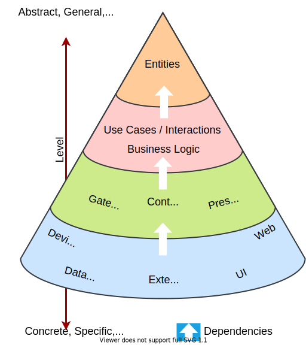
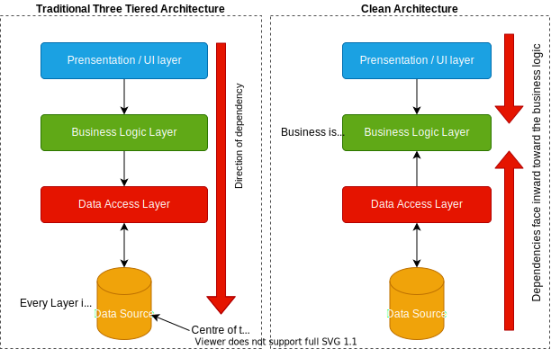

# Design Specification and Technical Design Decisions

These pages detail the design of ORRAS in several difference perspectives

## High Level Design

### Clean Architecture

Developed by Robert C. Martin in 2017, as a synthesis of several other architectures. It promotes the use of dependency inversion to build boundaries between high-level and low-level components. The result is an architecture where all software dependencies point inward to the core business rules, outer details act like "plug-ins" that are easily swappable. This architecture is independent of frameworks, UI and database, and is highly testable.

#### Compared to Traditional Architecture

In traditional tiered architecture all dependencies point to the database and so if the database schema or the database itself changes so must the layers that depend on it. Whereas in Clean Architecture all dependencies point inward towards the business rules that rarely change, all other layers are treated as details or implementations of the functions that the business rule require.

### ORRAS System Level Design

The current prototype design is a single page application comprising of a .NET 5 Web API backend and a client frontend design with React.js
The design follows RESTful API design; using HTTP verbs GET, POST, PUT, PATCH and DELETE to communicate between client to the backend in a stateless way.
This means client and backend can be developed separately with only the knowledge of how to send and receive http requests and to which API endpoint.

### ORRAS Project Level Design

## Low Level Design

- Use Cases
- Features / User Stories

## Design Patterns

### Command Query Responsibility Separation (CQRS)

### Mediator Pattern

 Jimmy Bogard's MediatR package

### CQRS and Mediator together

allows the inversion of dependency, the control flow

#### Validation of Requests sent to APIs

We do not want dirty/non-conforming requests being passed to the backend interacting with other parts of our code or persisted to database. This can risk the integrity of the data in the database and increase the likelihood of invalid values/data being used by other parts of the system, which could well result in exceptions, that if are not handled correctly will cause errors.
The Validation of Requests made to the API from the Client is a cross-cutting concern, in other words no matter what request is being handled, we are likely to want to validate it first before doing anything else with it.

We can take advantage of the mediator patten by adding some behaviour to the request pipeline to handle exceptions and return error messages to the client.

A library called FluentValidations can help with this.

It allows us to create Validators for each Query or Command and then inject a checking behaviour into the request pipeline that will ensure requests confirm to pre-defined constraints (definition of valid)

by doing this we can control what http response status code is returned with our exception meaning for example, a 404 Not Found is returned for an exception where the particular resource is not found, rather than returning a less useful 500 internal server error.

#### Logging of Requests

logging is another common concern that is cross-cutting - we want to log when things happen and when errors / exceptions ocurr in the program. in the same way we can inject logging behavior into our request pipeline using the mediator pattern
