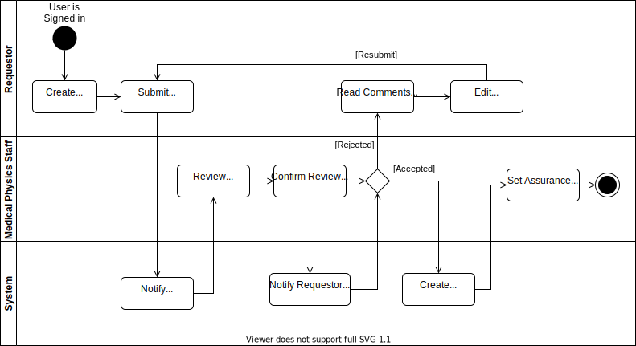

# Study Assurance Request

Definition: _A study assurance request is a request for a study to undergo some local assurance or governance process, details of which depend on the type of assurance service being requested._

In its simplest form it is a request for work with an associated study proforma against it

## Workflow  Diagram

## General Steps

1. Request is Created
2. Request is Submitted
3. Request is Reviewed
4. Request is Accepted
   1. A Study Record is created from the information in the Request
   2. The Study Record is placed on a workflow to manage the requested work

OR

5. Request is Rejected and a reason is provided to the requestor
6. The Requestor is able to edit and resubmit their request

Copyright © (2021) Oxford University Hospitals NHS Foundation Trust
