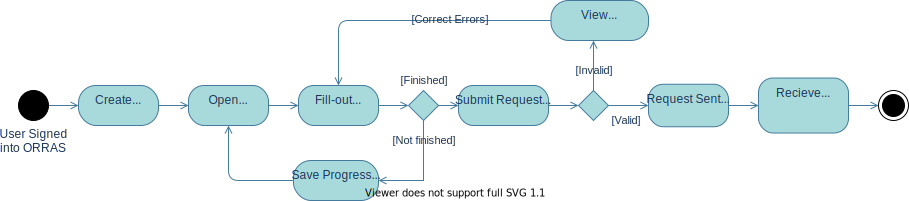

 # Raise a Study Assurance Request

 ## Workflow Diagram
 

 ## General Steps
 1. Requestor Registers to ORRAS (if not already a user of the service)
 2. Requestor signs into ORRAS
 3. Requestor chooses to create a new Study Assurance Request
 4. Requestor fills out Request form with details of the study they want assured
 5. Requestor can either **save the request for later** or **submit the request for review**
 6. Requestor is given confirmation of their submission

## Constraints

## Acceptance Criteria

## GUI Mock

Copyright © (2021) Oxford University Hospitals NHS Foundation Trust
