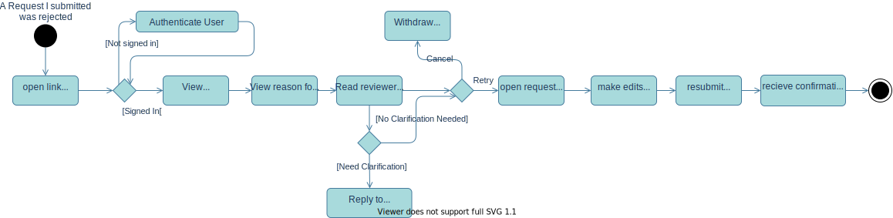

# Resubmit Assurance Request
*Occurs when a submitted assurance request is rejected by the reviewer*

### User Story
_As the study assurance requestor, I want to edit and resubmit a request that was rejected to avoid having to recreate the whole request._

## Workflow Diagram

## General Steps
1. Requestor is notified of rejection of their request
2. Requestor follows link to their request
3. Requestor logs into system (if not already logged in)
4. Requestor reads reviewers' comments and reason for rejection
5. Requestor can reply back to reviewer to clarify any required information / points raised
6. Requestor can Edit the Rejected Request
7. Requestor makes changes to the information in the Request Form
8. Requestor re-submits changed request

Requestor can opt to delete original request ->
all Form information should be deleted, but meta data and request info should remain.

## Constraints

## Acceptance Criteria

## GUI Mock

