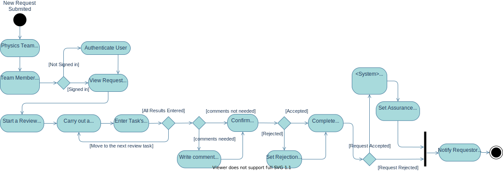

# Review a Study Assurance Request

## Workflow Diagram

## General Steps
1. Physics Team is notified that a new Study Assurance Request has been submitted and is awaiting review
2. A Physics team member logs in and views the Request
3. The physics team member can read and respond to any comments against the request
4. The team member starts an **review** against the request
5. they are now the **Request Reviewer** associated with the request
6. they are provided with a view of the request alongside a **review checklist**
7. they can check off each item/question on the checklist
8. they can edit the request to add more detail or make corrections if required
9. they submit there review and confirm an outcome along with a generic reason (if required)
- [Conditional] Review Outcome: Request is **Rejected** or **Accepted**
  - **REJECTED**: the Reviewer will be provided with an opportunity to write a comment back to the requestor before finalizing their review. The requestor will be provided with the detail of the failing criteria and the comment written by the reviewer
  -  *could provide a secondary outcome (reject with no ability to resubmit - when submission is not appropriate for us)*
  - **ACCEPTED**: 
    - the reviewer is asked to pick the most appropriate approval workflow to manage the approval said study (should default to the most appropriate - allows the ability to change approval workflow if required)
    - after confirmation, the system created the corresponding study record and the requestor is notified.

### Logical Checks/Tasks Performed by Request Reviewer
1. Has all the required documentation been uploaded?
2. Are all uploaded files valid for the associated study?
3. Are all uploaded files marked with a version number and date?
4. Are contacts assigned appropriate?
5. Are the contact details of each assigned contact up to date?
6. Does at least one procedure occur at OUH (local site)? (for local approvals)
7. Is IRAS Part B section 3 complete and valid?
8. Are all non-ionising procedures included in the study procedures list? (radiology require these)
9. Are details of any radiation exposures (both ionising and non-ionising) consistent throughout the application with no discrepancies or contradictions between documents?
10. 

? AUTOMATED CHECK (would need the licence numbers for each procedure per site, ) 

1. Are Nuclear Medicine (ARSAC) procedures covered by site licence?
2. Does the practitioner (or PI) have a corresponding licence for all procedures listed? 

### Notification Statements
**Rejected**: "Your request [requestid] for Research Radiation Assurance to be carried out for study [studyid] as been rejected due to [rejectionreason]. The reviewer has written the following comment '[comment here]'. You may edit your rejected request and re-submit it for review [here]"

**Accepted**:" " your request [requestid] for Research Radiation Assurance to be carried out for study [studyid] as been accepted. A study record has been created from your request and can be viewed [here]. The study will now undergo an assurance workflow to manage the technical assurance activities and governance checks required to provide approval"

## Constraints

## Acceptance Criteria

## GUI Mock
