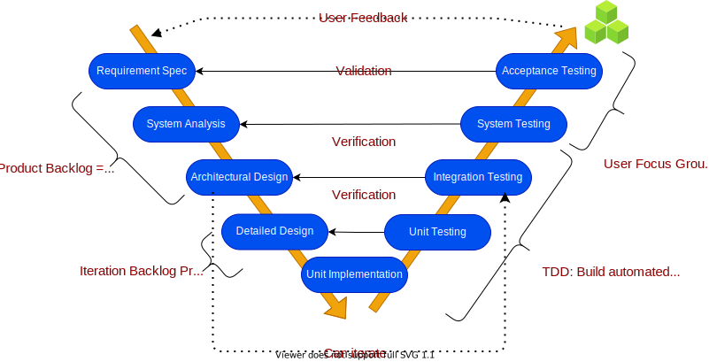
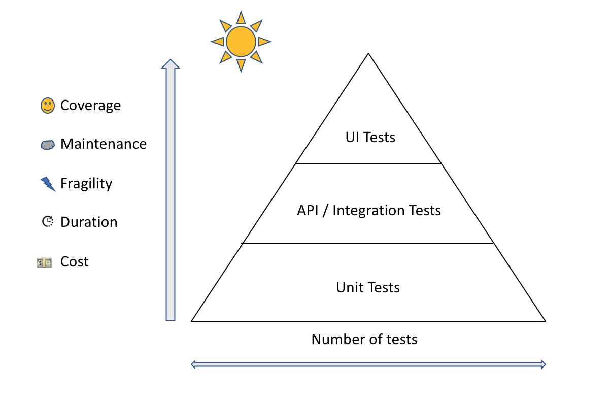
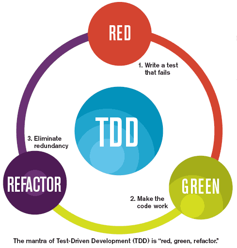

# Software Quality Assurance Strategy

An outline of the Software Quality Assurance Strategy used for this project. This project follows a modified version of the V-model, called the AV-Model.

A User Focus Group has been formed to facilitate many of the QA aspects described within this strategy.

## Validation

Validation is about determining if we have built the right product/solution. It involves checking that the design of the product, subunit or element meets the associated captured requirements, and that it solves the problem or serves the pre-determined purpose. Essentially, it is a process of checking that requirements have been correctly interpreted within the design and construction of the product and it is effective at solving the problems it was indented for. As this project is to produce a prototype that could be further developed into a full solution, validation will form two main parts of the development process, and iterate along with the rest of the software development cycle.

### The first-pass

The first validation stage is performed after requirements have been translated into a formalised design. This will include the critiquing of diagrams drawn in Universal Modelling Language (UML), or even mock ups of Graphical User Interfaces (GUIs). These will be shown to members of the User Focus Group, who will comment on their appropriateness and correctness when compared with the documented requirements.

### The second-pass

The second stage will be performed at the end of each iteration, where the final output of that iteration, whether it be a small or large feature/portion of the product is critiqued by the members of the User Focus Group and feedback is collected regarding the deliverables to further refine it and understand how well the constructed unit/feature meets those requirements that were initially set down at the beginning of the iteration. This is often referred to as Acceptance Testing.  

This acceptance testing will involve the User Focus Group interacting with the product in simulated scenarios and following a set of instructions to carry out a specified task. After each member has carried out the required actions, they will be asked to complete a questionnaire that will target aspects of the feature being evaluated and collect any expressions of concern or needs for improvement. Responses will be analysed, assessed and reported back to the project team, and an outline of the required changes, alterations or issues will be communicated and added to the product backlog to inform the next iteration or set of construction tasks.

## Verification

Verification is about determining if we have build the product / solution right. This is about assuring that the product complies with the specification it was built against and functions in the expected way given particular inputs or conditions. This is achieved by creating quality assurance tests that can determine or measure the outputs, functions, or attributes and compare them against what was expected. These tests should not only target expected behaviour but edge cases and scenarios that are outside the bounds of these, to understand system behaviour and enable us to correct it for unknowns. Theses are sometimes described as **happy** **path** and **sad** **path** scenarios which describe desired and undesired behaviour of a system.

Tests are important as they can measure and determine technical or behavioural aspects of our software, allowing us to refine our designs and evidence their conformance to standards and prescribed requirements, as well as safety aspects. Tests can be written to ascertain if the desired outcome for an error/bad scenario will occur or if the actual outcome would represent some bad state that may contribute to a previously identified Hazard. The result of such a tests can instigate a refactor or creation of code that is essentially a risk control measure to ensure a desired and safe outcome occurs, or that an unsafe outcome is dealt before it has impact. This can therefore help reduce risks associated with the software to acceptable levels in addition to making sure the software behaviour as expected.

The majority of tests will be automated tests written alongside the code being constructed. Writing code to test code being written builds a suite of quality assurance tests that can be run quickly and easily after each change is introduced. This allows us to understand how the change interacts with and affects other parts of our code base and works to prevent breaking changes being deployed into production code. It also promotes opportunities for refactoring our code to remove unnecessary dependencies and adhere to accepted best practices, such as the SOLID principles, by highlighting the impact of a change and alleviating the fear of breaking code by making changes.

## The Test Pyramid

The test pyramid is a helpful visualization to understand the different types io

Unit tests are cheap (quick to write and run), so they should constitute the bulk of our testing suite. Integration tests are broader, take longer to run and are more fragile, therefore we should seek to minimise the number of integration tests to only those necessary to provide suitable coverage with minimal overlap. UI Tests are the most expensive to write and run in-terms of resource, as this is essentially automating the user interaction with the system. UI Tests should focus on testing the modular UI components and assert if state is being correctly altered and the behaviour of these components is as expected. Some parts of UI testing is more difficult to automate, such as usability, layout and look, these will form part of acceptance testing instead.

### Example Test Plan

| Scenario | Expected Result | Latest Result | Automated |
|----------|-----------------|---------------|-----------|
| User clicks Login Button on Landing page | opens a login form within a modal component | pass | yes |
| User has recently logged into the site, closes their browser tab, and then navigates back to the webpage | login session persisted via cookies, the user does not need to authenticate again | pass | yes |
| Client makes sends HTTP GET call to the backend API with a GUID that does not match a study record within the database | Return a Not Found Exception with user friendly error message| pass | yes
| When a user submits a form to create a new company, and the company name entered is not unique | Action not completed, returns Validation Error with a message to explain the name is not unique | pass | yes |

### Test Driven Development (TDD)

Ideally our code and the tests we write should be developed following TDD principles.

1. We write a failing test - We take a feature, unit or scenario (as above) and write enough code to test the outcome without writing the code that implements the feature being tested.
2. We run our failing test and see it fail
3. We write enough code to make it pass
4. Run our test again and see it pass
5. We refactor our code for clarity and adherence to best practices
6. We run the test again and see it pass
7. We iterate through until each unit/scenario or feature is working as expected

This cycle is often referred to as Red, Green, Refactor.

There are various benefits to applying a TDD approach, the main ones are as follows:

- **Safer Refactoring** - Knowing that when you refactor the test that covers the expected behaviors has your back, removing the fear of breaking functionality and allowing us to investigate why tests aren't passing, promoting an awareness of the code's actual execution behaviour
- **Reduction of Bugs** - Increased code coverage of testing saves time downstream that would be spent fixing bugs that have appeared/become apparent. Often a good way to tackle a bug is to write a test first before attempting to solve the problem, this helps to ensure the fix is a true fix and won't re-occur in the same or similar form.
- **Increasing Returns** - Although the cost of TDD is higher at first, if compared with a project with no tests, the cost of no tests is significantly higher, where much of the later stages of the project are spent fixing bugs that could easily be avoided using tests. TDD not only saves time and therefore resource on fixing bugs, it also means the cost of changing functionality or introducing new features is less, because the tests act as a safety net to significantly reduce the chance of introducing breaking changes.
- **Efficient and Clean Code** - As TDD promotes starting from a stage that requires the minimal amount of code necessary, we actively seek to avoid complex evolutions of our code during the refactor stage, keeping it short, simple and easy to reason about.

### Backend Testing

As the backend of the proposed product is being built using Microsoft's .NET 5 Framework, there are three main testing frameworks that could be used to build our automated tests.

- [xUnit](https://xunit.net/)
- [NUnit](https://nunit.org/) 
- [MSTest](https://github.com/Microsoft/testfx-docs)

For this project NUnit was chosen as it is widely used, with strong support for .NET and .NET Core frameworks, and has an  easier learning curve when compared to that of XUnit.

#### Test Structure

Tests will be split out into separate projects, a project per package of the solution and per type of tests enclosed (integration or unit). Each test written should follow the Arrange, Act, Assert (AAA) Pattern and be named in a way that ensures it is easy to understand what is being tested. It is recommended that test names..

- Should express a specific requirement
- Could include the expected input or state and the expected result 
- Be presented as a statement or fact of life that expresses workflows or outputs
- Could include the name of the tested method or class

For example:

- ***Should_ExpectedBehaviour_Given_StateUnderTest***
- ***Given_Preconditions_When_StateUnderTest_Then_ExpectedBehaviour***

### Frontend / UI Testing

As the frontend of our product is being built with the React JavaScript library there are a number of tools and utilities we can use to build a testing toolkit that we can use to build UI and e2e tests for our React frontend web application. There are several testing frameworks available, including; Mocha, chai, Karma and Jest.

- [Jest](https://jestjs.io) is a popular and well-known testing framework for JavaScript and includes a test runner and assertion library 
- [Enzyme](https://enzymejs.github.io/enzyme/) is a JavaScript testing utility to make it simpler to test React components with Adapters
- [puppeteer](https://github.com/puppeteer/puppeteer) is a tool for performing end2end testing (simulated UI interactions / aka "smoke testing"). It is a headless Chrome tool created by Google, which uses Chromium as the browser environment.